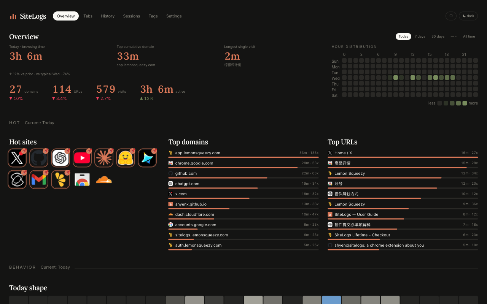
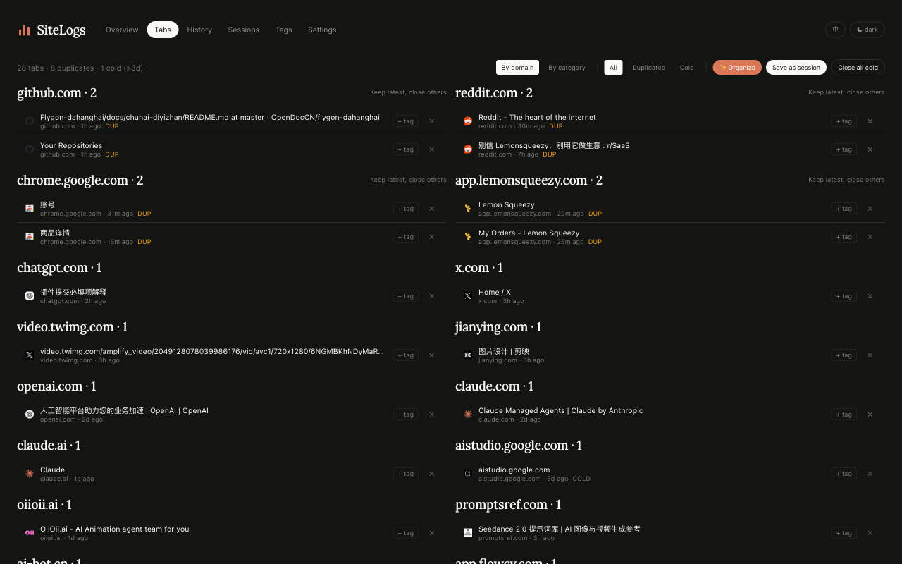
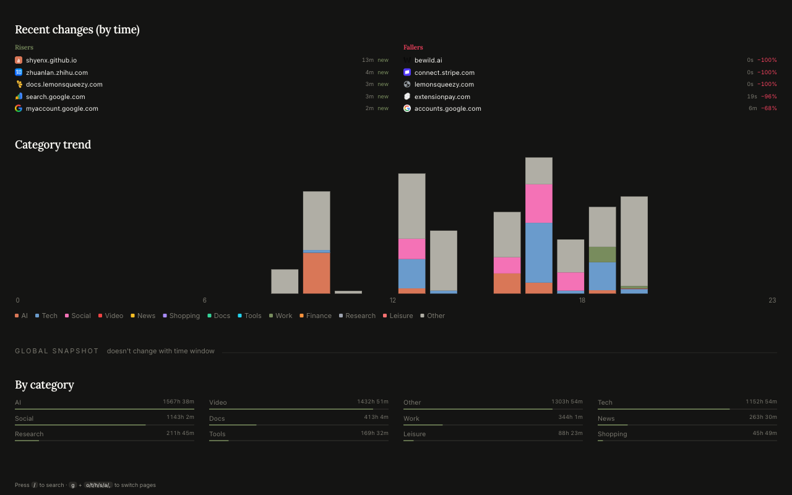
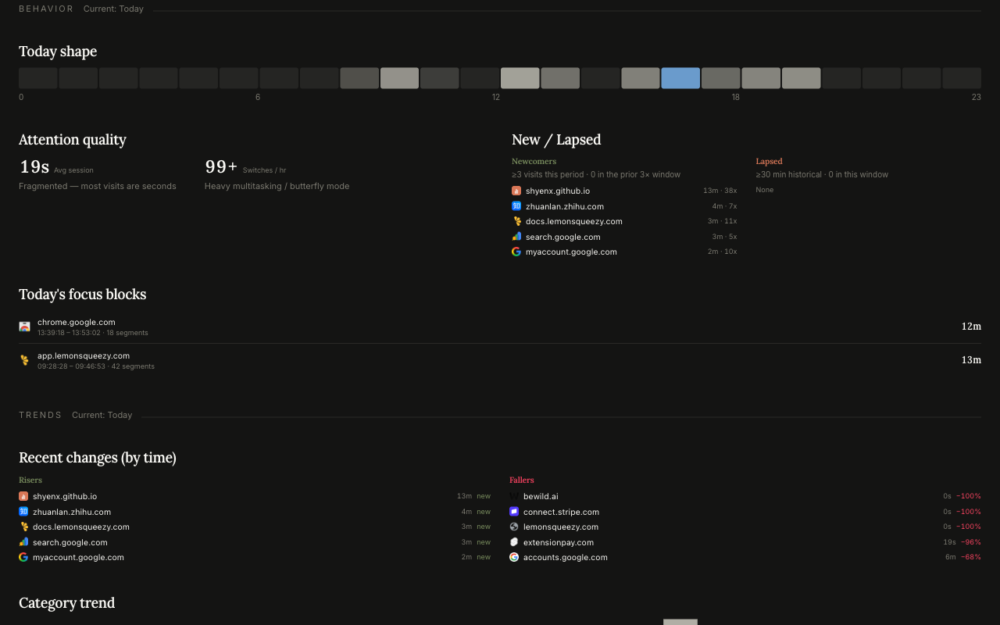

# SiteLogs

> See where your time actually goes online.
> Local-first browsing analytics, tab grouping, and focus blocks — for Chrome.

🌐 **Website**: <https://siteslogs.com>
🧩 **Install**: [Add to Chrome](https://chromewebstore.google.com/detail/cgmjcajdmdhmojploigcijmghbchmejj) — free 7-day trial, $15 lifetime

---

## What is SiteLogs?

SiteLogs is a Chrome extension that quietly records how long you spend on
each website — **on your own machine**. Daily, weekly, and yearly views
that Chrome's built-in History never gave you, plus a one-click tab
organizer and a custom new tab page worth opening.

- 🏠 **Replace Chrome's default new tab** — every new tab opens the SiteLogs dashboard with your stats and pinned sites instead of Google's blank search box.
- 📌 **Pin your top sites** — keep your most-visited workflows one click away on the new tab dashboard.
- 🗂️ **One-click tab cleanup** — close duplicate URLs, auto-group remaining tabs by domain into Chrome's native colored tab groups, and merge windows.
- 📦 **100% local** — visit data lives in IndexedDB on your device. No telemetry, no analytics, no external server.
- 🔍 **Honest time** — counts active focus minutes, pauses on idle.
- 🎯 **Focus budgets** — daily caps per category, with progress bars on the dashboard.
- 🪶 **Lightweight** — < 200 KB packed, no background tracking beyond what you'd expect.
- 🌏 **EN / 中文** — fully bilingual UI.

### A look inside

*One-click tab organizer — close duplicates, group by domain, save sessions.*

*Where your time actually goes — daily, weekly, monthly breakdowns by category.*

*Behavior view — productive vs leisure split, idle gaps removed.*

Read the full feature tour on [siteslogs.com](https://siteslogs.com) or the
[user guide](https://siteslogs.com/guide.html).

---

## About this repository

> ⚠️ **This repo is the marketing website, not the extension source code.**

What you see here are the static HTML pages that power
[siteslogs.com](https://siteslogs.com) — landing, guide, privacy policy,
terms, refund policy, contact, checkout pages. Plain Tailwind + vanilla JS,
no build step.

The extension itself (Vite + React + TypeScript, MV3) is developed in a
separate private repository. The compiled extension is distributed
exclusively through the **[Chrome Web Store](https://chromewebstore.google.com/detail/cgmjcajdmdhmojploigcijmghbchmejj)** — please install from there.

---

## Got a question or hit a bug?

**Open an issue right here in this repo** —
<https://github.com/shyenx/sitelogs-site/issues/new> — and we'll respond.
Bug reports, feature requests, refund follow-ups, license-key trouble,
or just saying hi: all welcome.

You can also email **<shyenx.site.support@gmail.com>** — see the
[contact page](https://siteslogs.com/contact.html) on the site.

---

## License & terms

- [Privacy Policy](https://siteslogs.com/privacy.html)
- [Terms of Service](https://siteslogs.com/terms.html)
- [Refund Policy](https://siteslogs.com/refund.html)

The extension is distributed under a proprietary license described at
purchase. Site content (this repo) is © 2026 SiteLogs.
