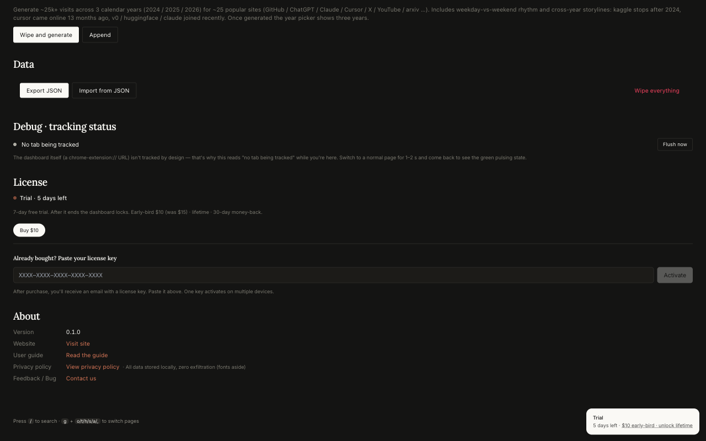

# SiteLogs

**See where your time actually goes online.**
Local-first browsing analytics, tab grouping, and a custom new tab — for Chrome.

[**Install**](https://chromewebstore.google.com/detail/cgmjcajdmdhmojploigcijmghbchmejj) · [**Website**](https://siteslogs.com) · [**Pricing**](https://siteslogs.com/pricing.html) · [**Privacy**](https://siteslogs.com/privacy.html) · [**Changelog**](./CHANGELOG.md) · [**Roadmap**](#-roadmap)

 

---

> 📦 **This repo is the marketing website, not the extension source code.**
> The extension itself is developed in a separate private repository and
> is distributed exclusively through the Chrome Web Store. Issues and
> feature requests are welcome here.

---

## ✨ What it does

Chrome's History tells you what you visited. SiteLogs tells you **where your hours went** —
on a dashboard that opens every time you open a new tab.

|     |     |
| :--: | --- |
| 🏠 | **Replaces Chrome's default new tab** with a personal dashboard — your daily, weekly, yearly stats and pinned shortcuts, every time. |
| 📌 | **Pin your top sites** for one-click access from the new tab page. |
| 🗂️ | **One-click tab cleanup** — close duplicate URLs, group remaining tabs by domain into Chrome's native colored tab groups, merge windows. |
| 📦 | **100% local** — visit data lives in IndexedDB on your device. No telemetry, no analytics, no external server. |
| 🔍 | **Honest time tracking** — counts active focus minutes, pauses on idle. Not "tab open duration". |
| 🎯 | **Daily focus budgets** — per-category caps with progress bars on the dashboard. |
| 🌏 | **EN / 中文** — fully bilingual UI. |
| 🪶 | **Tiny** — < 200 KB packed. No background tracking beyond what you'd expect. |

[Read the full feature tour →](https://siteslogs.com)

---

## 🖼 A closer look

<table>
<tr>
<td></td>
<td></td>
</tr>
<tr>
<td align="center"><b>Tab organizer</b> One-click dedupe + group by domain. Sessions save & restore.</td>
<td align="center"><b>Category trends</b> Daily, weekly, monthly — by category, with comparisons.</td>
</tr>
<tr>
<td></td>
<td></td>
</tr>
<tr>
<td align="center"><b>Behavior signals</b> Productive vs leisure split. Idle gaps removed.</td>
<td align="center"><b>Transparent pricing</b> Trial countdown, license activation — all in Settings.</td>
</tr>
</table>

---

## 🛡 Privacy in one sentence

> Your browsing data **never leaves your device.** No telemetry, no analytics,
> no external server. The only outbound calls are Google Fonts (will be
> self-hosted) and the license-key activation flow when you pay.

[Full Privacy Policy →](https://siteslogs.com/privacy.html)

---

## 💸 Pricing

| | Lifetime | Early bird (first 100) |
| --- | :---: | :---: |
| Price | **$15** | **$10** ($5 off) |
| Type | One-time payment | One-time payment |
| Updates | All future features included | All future features included |
| Devices | Up to 5 | Up to 5 |
| Refund | 30 days, no questions asked | 30 days, no questions asked |

7-day free trial — no credit card up front. Payments handled by **Paddle** (Merchant of Record).

[Pricing details →](https://siteslogs.com/pricing.html) · [Refund policy →](https://siteslogs.com/refund.html)

---

## 💬 Support & feedback

Have a question, a bug to report, or a feature idea?

> 🐞 **[Open an issue here](https://github.com/shyenx/sitelogs-site/issues/new)** — we read every one.
>
> 📧 Or email **[shyenx.site.support@gmail.com](mailto:shyenx.site.support@gmail.com)** — see the [contact page](https://siteslogs.com/contact.html).

Refund requests, license-key trouble, just-saying-hi: all welcome.

---

## 📦 Releases & changelog

- 🛒 **[Add to Chrome](https://chromewebstore.google.com/detail/cgmjcajdmdhmojploigcijmghbchmejj)** is the only supported install path. Auto-updates whenever we ship.
- 📜 **[CHANGELOG.md](./CHANGELOG.md)** — long-form per-version history with rationale.
- 🏷 **[All releases](https://github.com/shyenx/sitelogs-site/releases)** — same notes, organised per tag.

> We deliberately don't distribute the extension binary outside the Chrome
> Web Store. Going through CWS means every install is signed by Google,
> auto-updates, and shares a single `chrome.storage` namespace.

---

## 🗺 Roadmap

> Mirrored from the maintainer's roadmap. Updated whenever we ship.
> See something you'd like moved up? [Open an issue](https://github.com/shyenx/sitelogs-site/issues/new).

### ✅ Shipped

- Local-first tracking · IndexedDB-only, no telemetry
- Heatmap, focus blocks, narrative summaries
- One-click tab organize (dedupe + group + colour-code)
- EN / 中 bilingual UI
- Custom new tab dashboard with pinned-site tiles
- First-run import from Chrome history (opt-in modal, 30/90/365/All)
- License-key purchase + email delivery
- Compact tab-group titles (drops TLD, e.g. `mail.google.com` → `Google`)
- Confetti celebration on activation 🎉
- `?` keyboard-shortcut help modal

### 🛠 Next up

- **Smarter favicon resolution** — use real visited URL so Chrome's local cache hits more often; letter-avatar fallback for the genuinely missing ones
- **Self-hosted fonts** — drop the last network dependency
- **Bulk export → CSV** — currently JSON only

### 🌱 Later

- **Pro tier** — extended scopes, cross-device visit sync, advanced rules, weekly retro reports
- **Firefox / Edge** ports
- **Optional opt-in usage telemetry** — explicit consent only, helps prioritise what to build
- **Ask SiteLogs** — a prompt slot to ask Claude (BYO API key) questions about your own logs, runs locally

---

## 📜 License & terms

| | |
| --- | --- |
| 📋 [Privacy Policy](https://siteslogs.com/privacy.html) | What we collect (nothing about your browsing) |
| 📑 [Terms of Service](https://siteslogs.com/terms.html) | License grant, refunds, acceptable use |
| 💰 [Refund Policy](https://siteslogs.com/refund.html) | 30-day no-questions-asked guarantee |

The extension is distributed under a proprietary license described at purchase.
Site content (this repo) is © 2026 SiteLogs.

---

Made with care · maintained by an indie developer · feedback always welcome.

[**Add to Chrome**](https://chromewebstore.google.com/detail/cgmjcajdmdhmojploigcijmghbchmejj) · [**Website**](https://siteslogs.com) · [**Open an issue**](https://github.com/shyenx/sitelogs-site/issues/new)

